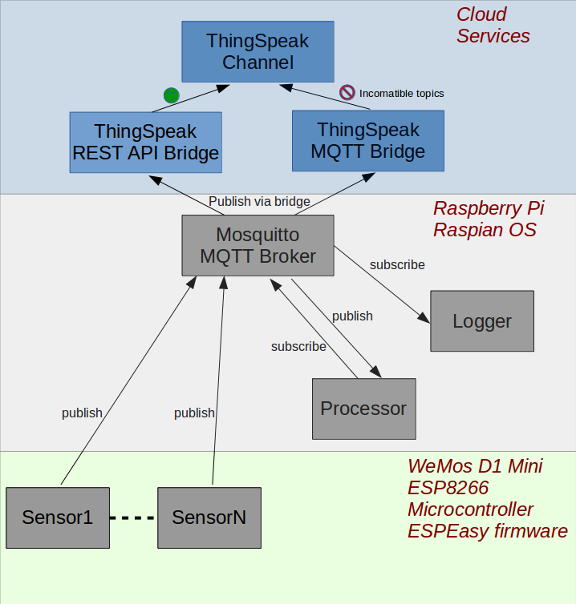

# IoTitan
IoTitan is a scalable system for monitoring and actuating IoT devices.

**For more information, see the [wiki](https://github.com/DataQub3/IoTitan/wiki)**

The current implementation is limited to home use.  Weather and motion sensors send data to a MQTT Broker.  Processing agents subscribe to the MQTT broker to calculate statistics and alerts.  Time aggregated values are forwarded to the Cloud for monitoring from anywhere.

## Architecture

## Important Files

### mqtt_processor_stats.py
The processor subscribes to a feed of MQTT messages for particular sensors. It calculates sensor statistics, then publishes those statistics back to MQTT.  Note: the input feed is taken from syslog to reduce load (since mqtt_logger.py already saves the data there).

### mqtt_processor_alerts.py
This processor monitors particular topics by subscribing to the MQTT broker.  It creates alerts when values are outside their expected range, and publishes those alerts back to the MQTT broker.

### mqtt_logger.py
The logger is a python script which subscribes to all topics on the Mosquitto MQTT server.  Hence it receives all sensor readings.  The logger stores everything in syslog (c.f. database) for medium-term storage.

### mqtt_logger.service
Systemd service file to start the MQTT logger script and ensure it runs at all times.  A prerequisite is the Mosquitto MQTT software must be installed.  Commands to control the logger service include:
* sudo systemctl status mqtt_logger
* sudo systemctl enable mqtt_logger
To view the output of this service in syslog run "sudo journalctl -u mqtt_logger"

### mqtt_bridge_thingspeak.py
This bridge is a script which subscribes to particular sensor readings (normally infrequent averages), and forwards the readings to the Cloud service Thingspeak via a REST API.

### mqtt_bridge_thingspeak.service
This systemd service file starts the python mqtt_bridge_thingspeak.py script and ensures it runs at all times.

**For more information, see the [wiki](https://github.com/DataQub3/IoTitan/wiki)**
