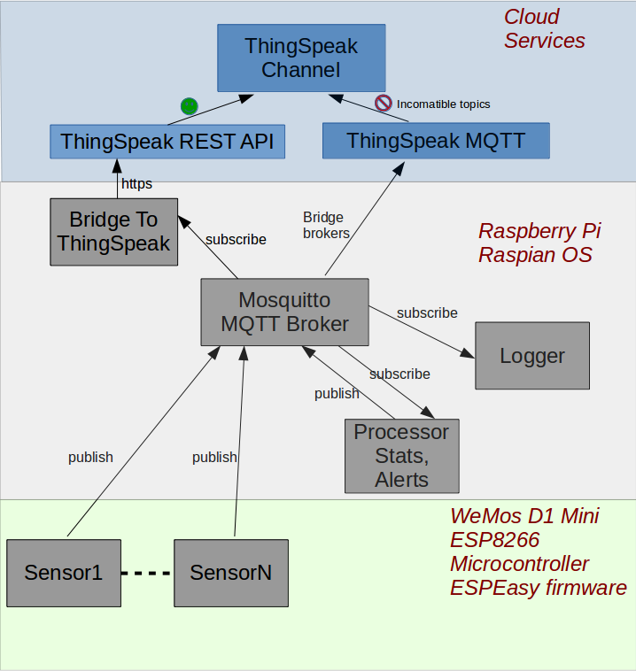

# IoTitan
IoTitan is a scalable system for monitoring and actuating IoT devices.

**For more information, see the [wiki](https://github.com/tadpoles/IoTitan/wiki)**

Current implementation is limited to home use.  Weather and motion sensors send data to a MQTT Broker.  Processing agents subscribe to the MQTT broker to calculate statistics and alerts.  Time aggregated values are forwarded to the Cloud for monitoring from anywhere.

## Architecture

## Important Files

### mqtt_processor_stats.py
Subscribe to a feed of MQTT messages for particular sensors. Calculate sensor statistics, then publish those statistics back to MQTT.  Note: The input feed is taken from syslog for simplicity (since mqtt_logger.py already saves the data there).

### mqtt_processor_alerts.py
Monitors some topics by subscribing to the MQTT broker.  Create alerts for values outside their expected range, and publish those alerts back to the MQTT broker.

### mqtt_logger.py
A python script which subscribes to all topics on the Mosquitto MQTT server.  Hence it receives all sensor readings.  The logger stores everything in syslog as an alternative to a database for medium-term storage.

### mqtt_logger.service
Systemd service file to start the MQTT logger script and ensure it runs at all times.
Prerequisite: mosquitto MQTT software must be installed

Sample commands to control the logger:
sudo systemctl status mqtt_logger
sudo systemctl enable mqtt_logger

The output of the mqtt_logger ends up in syslog.  To view the output run "sudo journalctl -u mqtt_logger"

### mqtt_bridge_thingspeak.py
A script which subscribes to sensor readings of interest, and forwards the readings to the cloud service Thingspeak via a REST API.

### mqtt_bridge_thingspeak.service
Systemd service file to start the python mqtt_bridge_thingspeak.py script and ensure it runs at all times.

**For more information, see the [wiki](https://github.com/tadpoles/IoTitan/wiki)**
